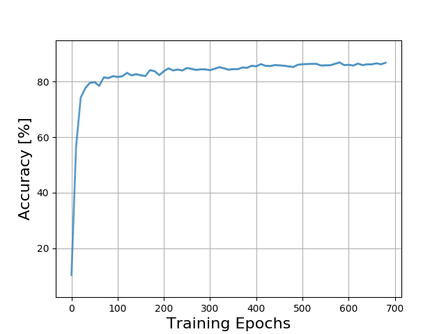

# A Keras implementation of the Recurrent Attention Model

The **Recurrent Attention Model**...
Instead processing the whole image, it uses *glimpses* at different locations.

The code is inspired by [2] & [3]

## Installation
Needed packages:
1. [numpy](http://www.numpy.org/)
2. [tensorflow](https://www.tensorflow.org/)
3. [Keras](https://keras.io/)
4. [opencv](https://opencv.org/)
5. [matplotlib](http://matplotlib.org/) for plotting
6. [h5py](http://www.h5py.org/)

Install the packages via `pip`.

```
pip install numpy tensorflow keras opencv-python matplotlib h5py
```

## Classification of the standard MNIST Dataset
To Train the network for classifying the standard MNIST Dataset, 
start the code via the corresponding confiuration file:
```
python run_mnist.py
```

The plot below shows the training accuracy for the first 400 epochs:


## Classification of the translated MNIST Dataset
To Train the network for classifying the translated MNIST Dataset, 
start the code via the corresponding confiuration file:
```
python run_translated_mnist.py
```


--------
[1] Mnih, Volodymyr, Nicolas Heess, and Alex Graves. "Recurrent models of visual attention." Advances in neural information processing systems. 2014.

[2] https://github.com/jlindsey15/RAM

[3] http://torch.ch/blog/2015/09/21/rmva.html